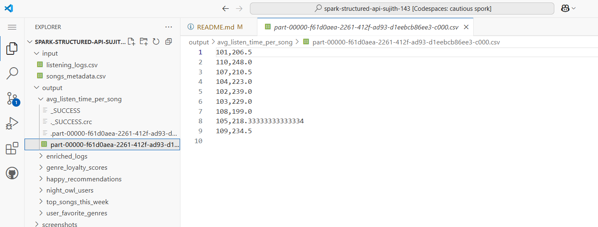

```markdown
#  Music Streaming Analysis using Spark Structured APIs

##  Overview of the Assignment

This assignment focuses on analyzing structured music listening data using **Spark Structured APIs**. We aim to uncover user behavior, listening trends, and generate smart recommendations. Using PySpark, we process two CSV datasets to extract insights such as users’ favorite genres, average song durations, night owl patterns, and more.

This project demonstrates:
- Data ingestion and cleaning using Spark
- Window functions, aggregations, and joins
- Conditional recommendations and filtering logic
- Structured output for real-world pipelines

---

##  Description of the Datasets

### **1. listening_logs.csv**
This dataset contains each user’s music listening activity:
- `user_id` – Unique ID for the user
- `song_id` – Unique ID for the song
- `timestamp` – Date & time the song was played (e.g., `2025-03-23 14:05:00`)
- `duration_sec` – Duration (in seconds) the song was played

### **2. songs_metadata.csv**
This dataset provides metadata for each song:
- `song_id` – Unique ID for the song
- `title` – Title of the song
- `artist` – Name of the artist
- `genre` – Genre (Pop, Rock, Jazz)
- `mood` – Mood category (Happy, Sad, Chill)

> Sample data was generated programmatically using two Python scripts located in the `scripts/` folder:
- `generate_listening_logs.py`
- `generate_songs_metadata.py`

---

##  Spark Tasks and Output Structure

Each Spark task processes data and saves results in a structured folder:

```
output/
├── user_favorite_genres/
├── avg_listen_time_per_song/
├── top_songs_this_week/
├── happy_recommendations/
├── genre_loyalty_scores/
├── night_owl_users/
├── enriched_logs/
```

###  Task 1: User's Favorite Genre
Find the most listened-to genre for each user.

🖼️ *Sample Output Screenshot:*  


---

###  Task 2: Average Listen Time Per Song
Compute average duration (seconds) per song.

🖼️ *Sample Output Screenshot:*  


---

###  Task 3: Top 10 Most Played Songs This Week
Filter songs played in the current week and return top 10 by count.

 *Sample Output Screenshot:*  


---

###  Task 4: Recommend "Happy" Songs to Sad Listeners
Find users who mostly listen to “Sad” songs and recommend up to 3 unplayed “Happy” songs.

 *Sample Output Screenshot:*  


---

###  Task 5: Genre Loyalty Score
Calculate loyalty score as the proportion of listens from the user's top genre. Output only users with score > 0.8.

 *Sample Output Screenshot:*  


---

###  Task 6: Identify Night Owl Users
Extract users frequently listening between 12 AM and 5 AM.

*Sample Output Screenshot:*  


---

##  PySpark Execution Commands

Ensure your working directory contains `input/` and `scripts/` folders and run:

```bash
# Generate the datasets
python scripts/generate_listening_logs.py
python scripts/generate_songs_metadata.py

# Submit the Spark job
python music_streaming_analysis.py
```

---

##  Errors Encountered & Resolutions

###  Error 1:
```
NameError: name 'rank' is not defined
```
**Cause**: Missing import for Spark SQL window functions.  
**Fix**: Added:
```python
from pyspark.sql.functions import rank
from pyspark.sql.window import Window
```

---

###  Error 2:
```
Empty output for genre_loyalty_scores and happy_recommendations
```
**Cause**: Sample data did not include enough plays or diversity in moods/genres.  
**Fix**: Updated data generation scripts to include:
- Users with clear genre preferences
- Listeners of "Sad" songs
- Night owl behavior
- Songs across all moods

---

## Final Result

The final pipeline processes structured logs and outputs meaningful user-level and song-level analytics. Screenshots and sample outputs are available in the `output/` and `screenshots/` folders.

---